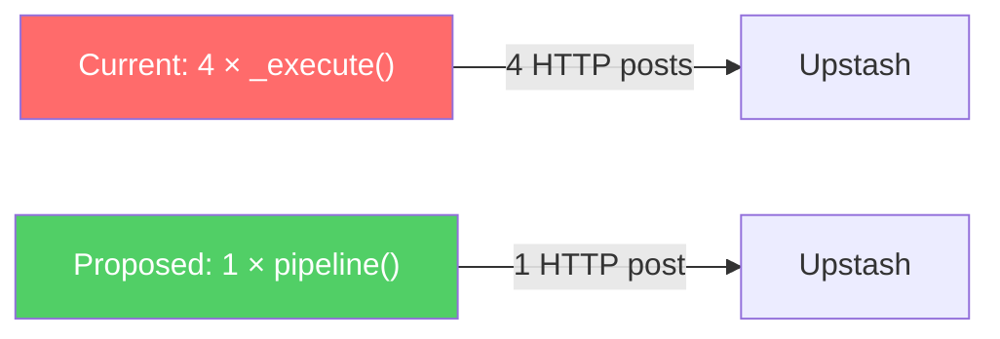

# Streamly Efficiency Audit Report

Comprehensive performance audit across all Python backend modules (~3,500 lines) and supporting infrastructure. Every finding is backed by a concrete `file:line` reference, impact estimate, and fix.

---

## Executive Summary

| Priority | Count | Cumulative Impact |
|---|---|---|
| 🔴 **P0 — Critical** | 6 | Eliminates **30–80 seconds** of dead time per large transfer; cuts search latency by **4–6×** |
| 🟠 **P1 — High** | 8 | Eliminates **10–25 seconds** per bulk operation; removes connection leaks |
| 🟡 **P2 — Medium** | 10 | Removes thousands of unnecessary task spawns, lock acquisitions, and redundant computations per transfer |
| 🟢 **P3 — Low** | 8 | Code hygiene, maintenance burden, and minor per-request overhead |

### Top 5 Must-Fix Now

| # | Finding | Where | Savings |
|---|---------|-------|---------|
| 1 | **Add Upstash REST Pipeline support** | `redis_store.py`, all callers | **30–60s cumulative dead time** per large transfer |
| 2 | **Parallelize series-mode search sub-queries** | `routes/search.py:165-177` | **12–36s → 3–6s** wall-time |
| 3 | **Fix N+1 sequential progress API calls in `list_items`** | `cloud_service.py:180` | **2–50s** per folder listing |
| 4 | **Add lightweight `get_storage_usage()` method** | `cloud_service.py` / `routes/cloud.py:337` | **2–50s** per `add_magnet` |
| 5 | **Remove global DNS lock serialization** | `security.py:110-113` | Unblocks **all** concurrent pinned HTTP requests |

---

## P0 — Critical Findings

---

### [EFF-01] Upstash REST API: Every Redis Command Is a Separate HTTPS Round-Trip 🔴
- **Where**: [redis_store.py:32](file:///d:/Web%20based/Streamly/streamly/redis_store.py#L32) (`_execute`), all callers
- **What**: Every `rs._execute()`, `rs.get()`, `rs.set()` call is a full **HTTP POST over TLS** to Upstash's REST API (~50–200ms each). Multi-command sequences are executed sequentially, turning what should be microsecond Redis operations into hundreds of milliseconds.
- **Worst offenders** (sequential calls that could be pipelined):

| Location | Sequential Calls | Est. Latency |
|----------|-----------------|-------------|
| [telegram.py:229-245](file:///d:/Web%20based/Streamly/streamly/routes/telegram.py#L229-L245) — progress persist | `INCRBY` + `EXPIRE` + `SET` + `EXPIRE` = 4 calls | 200–800ms **per persist cycle** (×30 = **24s** per transfer) |
| [telegram.py:291-339](file:///d:/Web%20based/Streamly/streamly/routes/telegram.py#L291-L339) — dispatch | `SET NX` + `GET` + `LPOP` + `GET` + `GET` + `SET` + `SET` + `DEL` = 8 calls | 400–1600ms per dispatch |
| [telegram.py:1029-1032](file:///d:/Web%20based/Streamly/streamly/routes/telegram.py#L1029-L1032) — auth cleanup | 4× `DEL` | 200–800ms per login |
| [app.py:521-527](file:///d:/Web%20based/Streamly/streamly/app.py#L521-L527) — startup | `SET` + 4× `DEL` = 5 calls | 250–1000ms startup |
| [redis_store.py:147-148](file:///d:/Web%20based/Streamly/streamly/redis_store.py#L147-L148) — log flush | `LPUSH` + `LTRIM` = 2 calls | 100–400ms per flush cycle |

- **Impact**: Over a 10-minute transfer, ~30 progress persist cycles × 800ms = **~24 seconds** of pure dead time just waiting on HTTP round trips.
- **Fix**: Add a `pipeline()` method to `RedisStore` using [Upstash's `/pipeline` endpoint](https://upstash.com/docs/redis/features/restapi#pipeline):
```python
async def pipeline(self, *commands: list[str]) -> list[Any]:
    client = await HttpClientManager.get_instance().get_client()
    r = await client.post(
        f"{self.url}/pipeline",
        headers=self._headers,
        json=[list(cmd) for cmd in commands],
        timeout=self.timeout,
    )
    r.raise_for_status()
    return [item.get("result") for item in r.json()]
```
  Then batch all sequential `_execute` calls into single `pipeline()` calls. Also use multi-key `DEL key1 key2 ...` (Redis supports this natively).

---

### [EFF-02] Series-Mode Search Fires 5–12+ Sequential HTTP Sub-Queries 🔴
- **Where**: [routes/search.py:165-177](file:///d:/Web%20based/Streamly/streamly/routes/search.py#L165-L177)
- **What**: Series mode fires a broad query, then sequentially queries `{query} {quality} x265`, `{query} {quality} hevc`, `{query} {quality} {encoder}` for each quality/encoder combination. Each sub-query blocks on the previous one completing.
- **Impact**: At ~1–3s per upstream API call, **12–36 seconds wall-time** for a typical series search.
- **Fix**: Fire all independent sub-queries concurrently with `asyncio.gather()`:
```python
# After broad_rows = await series_round_search(query)
tasks = []
for ql in qualities_list:
    tasks.append(series_round_search(f"{query} {ql} x265"))
    tasks.append(series_round_search(f"{query} {ql} hevc"))
results = await asyncio.gather(*tasks)
```
  Expected improvement: **12–36s → 3–6s** (limited by slowest single provider response).

---

### [EFF-03] N+1 Sequential Progress API Calls in `list_items` 🔴
- **Where**: [cloud_service.py:180](file:///d:/Web%20based/Streamly/streamly/cloud_service.py#L180) (loop calling `_serialize_transfer`)
- **What**: `list_items` iterates up to 100 torrents and **sequentially** calls `_serialize_transfer()` for each. If the torrent has a `progress_url`, this triggers an additional HTTP call to Seedr's progress endpoint. Classic **N+1 query pattern**.
- **Impact**: With 10 active transfers: 10 × 200–500ms = **2–5 seconds** of sequential blocking. With 100: **20–50 seconds**.
- **Fix**: Parallelize with `asyncio.gather()`:
```python
transfers = await asyncio.gather(
    *[self._serialize_transfer(async_seedr, t)
      for t in (contents.torrents or [])[:100]],
    return_exceptions=True,
)
transfers = [t for t in transfers if not isinstance(t, Exception)]
```

---

### [EFF-04] `add_magnet` Calls Full `list_items` Just for Storage Check 🔴
- **Where**: [routes/cloud.py:337](file:///d:/Web%20based/Streamly/streamly/routes/cloud.py#L337)
- **What**: Before adding a magnet, the code calls `cloud.list_items(client, 0)` to check storage usage. This triggers the **entire** listing pipeline: all folders, all files, all transfers (with the N+1 progress calls from EFF-03). But the caller only needs `used`, `max`, and `len(transfers)`.
- **Impact**: Potentially the **single biggest hot-path efficiency issue**. Every torrent addition pays the full cost of listing all content.
- **Fix**: Add a lightweight `get_storage_info(client)` method to `CloudService`:
```python
async def get_storage_info(self, client) -> dict:
    """Returns {used, max, active_transfers} without fetching full content."""
    http_client = await self._get_client()
    async with AsyncSeedr(token=client, httpx_client=http_client) as seedr:
        contents = await seedr.list_contents(folder_id="0")
        return {
            "used": getattr(contents, "space_used", 0) or 0,
            "max": getattr(contents, "space_max", 1) or 1,
            "active_transfers": len(contents.torrents or []),
        }
```

---

### [EFF-05] Global DNS Lock Serializes ALL Concurrent Pinned HTTP Requests 🔴
- **Where**: [security.py:110-113](file:///d:/Web%20based/Streamly/streamly/security.py#L110-L113)
- **What**: `_GLOBAL_DNS_LOCK = asyncio.Lock()` is held for the **entire duration** of every `async_pinned_get()` call — including the full HTTP request, not just the DNS patch. Only **one** pinned request can execute at a time across the entire application.
- **Impact**: If one pinned GET takes 5 seconds, all others queue behind it. Under concurrent search load, this is a hard serialization bottleneck.
- **Fix**: Replace the `socket.getaddrinfo` monkey-patch with httpx transport-level pinning:
```python
async def async_pinned_get(url, pinned_ip, client, **kwargs):
    parts = urlsplit(url)
    host = parts.hostname
    kwargs.setdefault("follow_redirects", False)
    headers = dict(kwargs.pop("headers", {}))
    headers["Host"] = host
    pinned_url = url.replace(f"//{host}", f"//{pinned_ip}", 1)
    return await client.get(pinned_url, headers=headers, **kwargs)
```

---

### [EFF-06] Blocking `os.walk()` on EVERY Page Load for Cache-Busting Version 🔴
- **Where**: [app.py:346-354](file:///d:/Web%20based/Streamly/streamly/app.py#L346-L354)
- **What**: The `GET /` handler calls `os.walk()` over the entire `static/` directory on every single page load to compute `asset_ver`. This is a **blocking I/O syscall** that stalls the event loop.
- **Impact**: 5–50ms of blocking time per request depending on filesystem speed.
- **Fix**: Compute once at startup:
```python
# At create_app scope:
try:
    _asset_ver = int(max(
        os.path.getmtime(os.path.join(root, f))
        for root, _dirs, files in os.walk(HERE / "static") for f in files
    ))
except ValueError:
    _asset_ver = 1
```

---

## P1 — High Findings

---

### [EFF-07] Sequential Bulk Delete — N+1 Pattern 🟠
- **Where**: [routes/cloud.py:182-192](file:///d:/Web%20based/Streamly/streamly/routes/cloud.py#L182-L192)
- **What**: `delete_bulk` loops through up to 100 items calling `cloud.delete_item()` sequentially. Each call creates a new `AsyncSeedr` instance and makes an HTTP request.
- **Impact**: Deleting 50 items = 50 × 200–500ms = **10–25 seconds**.
- **Fix**: Parallelize with `asyncio.gather()` + semaphore (cap at 5–10 concurrent).

---

### [EFF-08] N+1 Redis Queries in Queue Endpoints 🟠
- **Where**: [telegram.py:120-133](file:///d:/Web%20based/Streamly/streamly/routes/telegram.py#L120-L133) (`get_projected_bandwidth`), [telegram.py:1286-1304](file:///d:/Web%20based/Streamly/streamly/routes/telegram.py#L1286-L1304) (`get_telegram_queue`)
- **What**: Both endpoints do `LRANGE` to get all queue task IDs, then loop calling `rs.get()` individually for each task's args. Classic N+1 pattern.
- **Impact**: For 5 queued items: 6 HTTP round trips = **300–1200ms** per call. The queue endpoint is polled by the frontend.
- **Fix**: Use `MGET` to fetch all task_args in a single call:
```python
keys = [f"streamly:task_args:{tid}" for tid in task_ids]
results = await rs._execute("MGET", *keys)
```

---

### [EFF-09] Blocking DNS Resolution in Async Code Path 🟠
- **Where**: [security.py:69-70](file:///d:/Web%20based/Streamly/streamly/security.py#L69-L70)
- **What**: `validate_public_url()` calls `socket.getaddrinfo()` — a blocking syscall — from async route handlers. DNS lookups can take 50–5000ms, during which the event loop is frozen.
- **Fix**: `infos = await asyncio.to_thread(socket.getaddrinfo, host, port, proto=socket.IPPROTO_TCP)`

---

### [EFF-10] Jinja2 Template Re-Compiled on Every Invocation 🟠
- **Where**: [app.py:272, 368, 385](file:///d:/Web%20based/Streamly/streamly/app.py#L272)
- **What**: `Template(SITE_LOGIN_HTML)` re-compiles the Jinja2 template from raw string on every call — inside the middleware (every unauthenticated request), `GET /site-login`, and `POST /site-login`.
- **Fix**: Compile once at module scope: `_SITE_LOGIN_TEMPLATE = Template(SITE_LOGIN_HTML)`

---

### [EFF-11] New `OffcloudService` Instance (+ TCP Connection) Created Per Request 🟠
- **Where**: [routes/offcloud.py:46](file:///d:/Web%20based/Streamly/streamly/routes/offcloud.py#L46), called from 5+ routes
- **What**: When Offcloud key is stored in Redis, `_get_offcloud()` creates a brand-new `OffcloudService` instance on every request. Each new instance opens a fresh TCP+TLS connection.
- **Impact**: ~100–300ms extra per Offcloud API operation.
- **Fix**: Cache the `OffcloudService` instance on `app.state` after first creation.

---

### [EFF-12] No Search Result Caching 🟠
- **Where**: [search_service.py](file:///d:/Web%20based/Streamly/streamly/search_service.py) — `_run_provider()`
- **What**: Every identical search query hits external APIs every time. There is no TTL cache for search results.
- **Impact**: Repeated queries within seconds (user hitting refresh) each add 1–3s of latency.
- **Fix**: Add a TTL cache (e.g., `cachetools.TTLCache(maxsize=256, ttl=120)`) keyed by `(provider, query)`.

---

### [EFF-13] Repeated `AsyncSeedr` Instantiation Per API Call 🟠
- **Where**: [cloud_service.py:93, 162, 214, 224, 230, 249, 267](file:///d:/Web%20based/Streamly/streamly/cloud_service.py#L93) (7 occurrences)
- **What**: Every method creates `async with AsyncSeedr(token=..., httpx_client=...) as seedr:`, instantiating and tearing down a new wrapper object per call.
- **Fix**: Cache and reuse the `AsyncSeedr` instance per token.

---

### [EFF-14] `RedisStore._execute()` Fallback Leaks `httpx.AsyncClient` 🟠
- **Where**: [redis_store.py:36-39](file:///d:/Web%20based/Streamly/streamly/redis_store.py#L36-L39)
- **What**: When `HttpClientManager.get_instance()` fails, a fresh `httpx.AsyncClient` is created but never closed — leaking connections and file descriptors.
- **Fix**: Cache a single fallback client on `self._fallback_client`.

---

## P2 — Medium Findings

---

### [EFF-15] Progress `_live_set` Called on EVERY 512KB Chunk — Excessive Task Spawning 🟡
- **Where**: [telegram.py:187-196](file:///d:/Web%20based/Streamly/streamly/routes/telegram.py#L187-L196)
- **What**: `_live_set()` is called on **every** progress callback invocation (every 512KB chunk), each spawning an `asyncio.create_task`. The time/percentage threshold at line 171 only gates Redis persist, NOT the in-memory update.
- **Impact**: For a 1GB file: ~2048 lock acquisitions + ~4096 task objects created and discarded.
- **Fix**: Move `_live_set` inside the time/percentage threshold, or update the in-memory dict directly without spawning a task (it's a sync dict write, the lock is unnecessary in single-threaded asyncio).

---

### [EFF-16] `_LIVE_PROGRESS_LOCK` Is Unnecessary in Single-Threaded Asyncio 🟡
- **Where**: [telegram.py:44, 55-78](file:///d:/Web%20based/Streamly/streamly/routes/telegram.py#L44)
- **What**: `asyncio.Lock()` guards dict reads/writes that contain no `await` statements. In single-threaded asyncio, synchronous dict operations are inherently atomic — no coroutine switch can occur between them.
- **Fix**: Remove the lock. The operations (`dict.__setitem__`, `dict.get`, `dict.pop`) don't yield control.

---

### [EFF-17] Redundant `EXPIRE` on Bandwidth Key Every Flush Cycle 🟡
- **Where**: [telegram.py:231-232](file:///d:/Web%20based/Streamly/streamly/routes/telegram.py#L231-L232)
- **What**: `EXPIRE` is called on `monthly_bandwidth:{ym}` every 60 seconds, but the 60-day TTL only needs to be set once when the key is first created.
- **Fix**: Set EXPIRE only on first `INCRBY` (use a local flag, or use `SET ... EX ... NX` to initialize with TTL).

---

### [EFF-18] 12+ Uncompiled Regex Patterns in Search Hot Path 🟡
- **Where**: [search_service.py:91, 115, 117, 124, 129, 137, 151, 159, 192-196](file:///d:/Web%20based/Streamly/streamly/search_service.py#L91)
- **What**: Functions `_normalize_encoder()`, `_extract_encoder()`, `_norm_tokens()`, `_clean_query_tokens()` use inline `re.sub`/`re.search`/`re.match`/`re.fullmatch` calls. Called per-row (50+ times per search).
- **Impact**: ~300–500 avoidable regex compilations per search request.
- **Fix**: Pre-compile all patterns to module-level constants.

---

### [EFF-19] SSL Context Recreated Per Download 🟡
- **Where**: [core/http_client.py:132, 176](file:///d:/Web%20based/Streamly/streamly/core/http_client.py#L132)
- **What**: `create_ssl_context()` is called in both `_download_via_worker()` and `_download_via_direct()`. Each call creates a new `ssl.SSLContext`.
- **Fix**: Create once in `OptimizedDownloader.__init__`.

---

### [EFF-20] New `httpx.AsyncClient` Per Download — No Connection Reuse 🟡
- **Where**: [core/http_client.py:134, 178](file:///d:/Web%20based/Streamly/streamly/core/http_client.py#L134)
- **What**: Both download methods create a brand-new `AsyncClient` per download. Zero TCP/TLS connection reuse between downloads.
- **Impact**: ~50–200ms overhead per download (TLS handshake).
- **Fix**: Maintain a persistent client in `OptimizedDownloader`.

---

### [EFF-21] Non-Atomic Read-Modify-Write for History 🟡
- **Where**: [routes/history.py:59-66, 80-84](file:///d:/Web%20based/Streamly/streamly/routes/history.py#L59-L66), [routes/queue.py:27-51](file:///d:/Web%20based/Streamly/streamly/routes/queue.py#L27-L51)
- **What**: Both `add_history` and `add_to_history_backend` perform GET → parse JSON → modify list → serialize → SET. No atomicity. Under concurrent requests, writes can be lost.
- **Fix**: Use Redis list operations (LPUSH/LREM) directly, or use a Lua script for atomicity.

---

### [EFF-22] No Seedr API Response Caching 🟡
- **Where**: [cloud_service.py](file:///d:/Web%20based/Streamly/streamly/cloud_service.py) — all methods
- **What**: There is zero caching of Seedr API responses. `list_items` is called for both UI display AND the storage check in `add_magnet`. A short TTL (5–10s) would eliminate redundant calls during rapid interactions.

---

### [EFF-23] Rate Limiter O(n) Eviction on 50K Buckets 🟡
- **Where**: [security.py:212-220](file:///d:/Web%20based/Streamly/streamly/security.py#L212-L220)
- **What**: When `max_keys` is hit, `_evict_locked()` scans all 50,000 buckets linearly to find idle or oldest entries.
- **Fix**: Use `collections.OrderedDict` with `move_to_end()` on access and `popitem(last=False)` for O(1) eviction.

---

### [EFF-24] `os.getenv("SITE_PASSWORD")` and `"SPACE_ID" in os.environ` on Every Request 🟡
- **Where**: [app.py:265, 277](file:///d:/Web%20based/Streamly/streamly/app.py#L265)
- **What**: The security middleware reads environment variables on every single HTTP request. These values never change at runtime.
- **Fix**: Read once at startup, capture in closure.

---

## P3 — Low Findings

---

### [EFF-25] Unbounded `_LOG_QUEUE` Deque 🟢
- **Where**: [app.py:125](file:///d:/Web%20based/Streamly/streamly/app.py#L125)
- **What**: `deque()` without `maxlen`. If Redis is down, log lines accumulate without bound.
- **Fix**: `deque(maxlen=100_000)`

---

### [EFF-26] `import time` Inside Loop Body 🟢
- **Where**: [routes/queue.py:193](file:///d:/Web%20based/Streamly/streamly/routes/queue.py#L193)
- **Fix**: Move to top-level import.

---

### [EFF-27] Repeated `4.5 * 1024 * 1024 * 1024` Computation 🟢
- **Where**: [routes/cloud.py:269, 313](file:///d:/Web%20based/Streamly/streamly/routes/cloud.py#L269), [routes/queue.py:155, 290](file:///d:/Web%20based/Streamly/streamly/routes/queue.py#L155)
- **Fix**: Define `SEEDR_SIZE_CAP = int(4.5 * 1024 * 1024 * 1024)` once in `config.py`.

---

### [EFF-28] Duplicate Download Logic in `OptimizedDownloader` 🟢
- **Where**: [core/http_client.py:121-166 vs 168-201](file:///d:/Web%20based/Streamly/streamly/core/http_client.py#L121-L201)
- **What**: `_download_via_worker` and `_download_via_direct` are ~90% identical.
- **Fix**: Extract a shared `_stream_download()` helper.

---

### [EFF-29] Redundant `_quality_bucket()` Call on Same Row 🟢
- **Where**: [search_service.py:335, 349](file:///d:/Web%20based/Streamly/streamly/search_service.py#L335)
- **What**: `_quality_bucket()` is called on the same row name that `parse_release()` already processed. The quality info is in the parse result.
- **Fix**: Use `info["quality"]` from the parse result.

---

### [EFF-30] Duplicate `_tokens()` Logic 🟢
- **Where**: [routes/search.py:82-86](file:///d:/Web%20based/Streamly/streamly/routes/search.py#L82-L86)
- **What**: Duplicates `_norm_tokens()` + `_clean_query_tokens()` from `search_service.py`.
- **Fix**: Import and reuse `_clean_query_tokens` from `search_service.py`.

---

### [EFF-31] Inline Import of `urllib.parse` in Route Handler 🟢
- **Where**: [routes/cloud.py:243](file:///d:/Web%20based/Streamly/streamly/routes/cloud.py#L243)
- **Fix**: Move to top-level import.

---

### [EFF-32] Duplicate State Dict Construction in Transfer Cleanup 🟢
- **Where**: [telegram.py:781-836](file:///d:/Web%20based/Streamly/streamly/routes/telegram.py#L781-L836)
- **What**: Three near-identical state dicts (completed/cancelled/failed) each do `_live_set` + `rs._execute SET`.
- **Fix**: Extract `_persist_final_state(rs, task_id, state)` helper.

---

## Architectural Recommendations

### 1. Implement Upstash Pipeline Support
The single highest-impact change. A `RedisStore.pipeline()` method that batches commands into one HTTP POST would eliminate **hundreds of unnecessary HTTPS round-trips** per hour.



### 2. Add Short-TTL In-Memory Cache for Seedr API
A 5–10 second TTL cache on `list_items(client, folder_id)` would eliminate redundant full API cascades during rapid user interactions (folder browsing, torrent addition).

### 3. Parallelize External API Calls
Both search sub-queries and bulk operations should use `asyncio.gather()` with bounded concurrency. The current sequential patterns leave 80–90% of available throughput on the table.

### 4. Cache `OffcloudService` Instance on `app.state`
When the API key comes from Redis, create the `OffcloudService` once and store it. This eliminates per-request TCP+TLS handshake overhead.

---

## Prioritized Remediation Table

| ID | Effort | Savings | Priority |
|---|---|---|---|
| EFF-01 | Medium | 30–60s per transfer | P0 |
| EFF-02 | Low | 4–6× search speedup | P0 |
| EFF-03 | Low | 2–50s per listing | P0 |
| EFF-04 | Low | 2–50s per add_magnet | P0 |
| EFF-05 | Low | Unblocks concurrency | P0 |
| EFF-06 | Low | 5–50ms/request | P0 |
| EFF-07 | Low | 10–25s for bulk ops | P1 |
| EFF-08 | Low | 300–1200ms per poll | P1 |
| EFF-09 | Low | 50–5000ms unblocking | P1 |
| EFF-10 | Low | 0.1–0.5ms/request | P1 |
| EFF-11 | Low | 100–300ms/request | P1 |
| EFF-12 | Low | 1–3s/repeated query | P1 |
| EFF-13 | Low | ~70ms per request cycle | P1 |
| EFF-14 | Low | Eliminates FD leak | P1 |
| EFF-15 | Low | ~4096 tasks/GB | P2 |
| EFF-16 | Low | ~2048 lock ops/GB | P2 |
| EFF-17 | Low | 50–200ms/transfer | P2 |
| EFF-18 | Low | ~1–3ms/search | P2 |
| EFF-19 | Low | ~1–5ms/download | P2 |
| EFF-20 | Low | ~50–200ms/download | P2 |
| EFF-21 | Medium | Correctness fix | P2 |
| EFF-22 | Medium | Multiple seconds saved | P2 |
| EFF-23 | Low | Eliminates latency spikes | P2 |
| EFF-24 | Low | Negligible per-req | P2 |
| EFF-25–32 | Low | Minor improvements | P3 |
